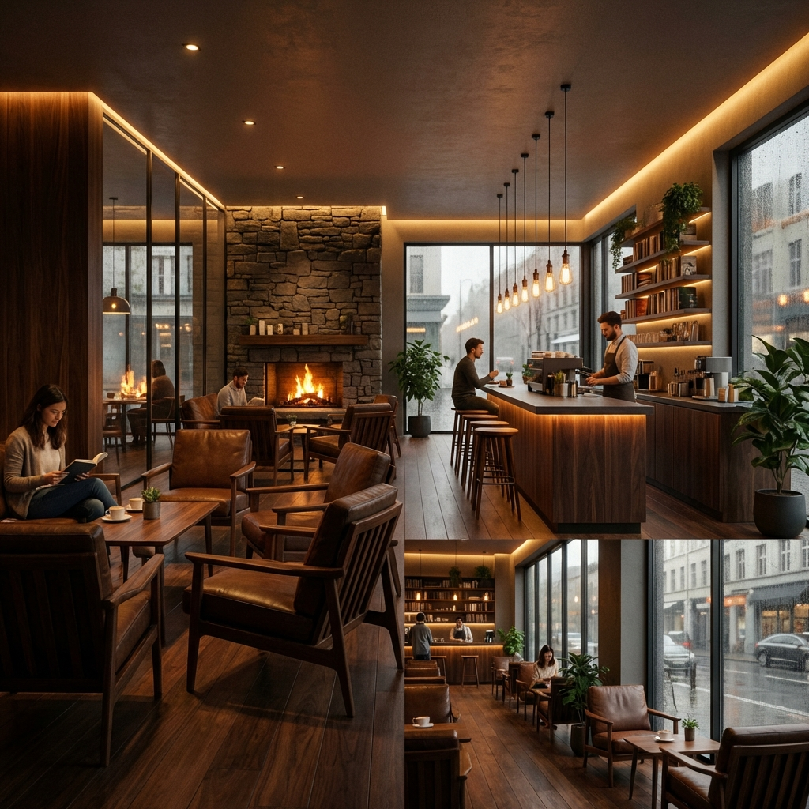

# ☕ Bean & Brew - Artisan Cafe Website

A modern, fully responsive website designed for **Bean & Brew**, a premium artisan coffee house. This project showcases a clean, aesthetic design with smooth animations, interactive menus, and a focus on user experience.



## ✨ Key Features

*   **Responsive Design:** Fully functional layout that adapts perfectly to desktop, tablet, and mobile screens.
*   **Modern Aesthetics:** Features a dark, elegant color palette (`#121212` & `#D4AF37`) with glassmorphism effects.
*   **Interactive Menu:** dynamically filtered menu sections for Coffee and Pastries using JavaScript.
*   **Smooth Animations:** Scroll-triggered reveal animations and a parallax hero section for an immersive feel.
*   **Mobile Navigation:** Custom hamburger menu with smooth transitions.

## 🛠️ Technologies Used

*   **HTML5:** Semantic structure and accessibility.
*   **CSS3:** Flexbox, Grid, CSS Variables, Animations, and Media Queries.
*   **JavaScript (ES6+):** DOM manipulation for menu filtering and scroll effects.
*   **Google Fonts:** *Playfair Display* (Headings) & *Outfit* (Body).
*   **Font Awesome:** For scalable vector icons.

## 🚀 How to Run

1.  **Clone the repository:**
    ```bash
    git clone https://github.com/your-username/CafeWebsite.git
    ```
2.  **Open the project:**
    Navigate to the project folder and open `index.html` in your web browser.
    ```bash
    cd CafeWebsite
    # On Windows
    start index.html
    # On Mac
    open index.html
    ```

## 📂 Project Structure

```
/CafeWebsite
│
├── index.html      # Main HTML structure
├── style.css       # Custom styles and animations
├── script.js       # Logic for filtering and interactivity
└── images/         # High-quality assets
```

## 🎨 Design Philosophy
The design prioritizes "visual comfort" using a dark mode theme to reduce eye strain while highlighting the premium nature of the brand with gold accents. The "Life begins after coffee" parallax section adds a touch of personality to the browsing experience.

---
*Created with ❤️ by [Your Name]*
